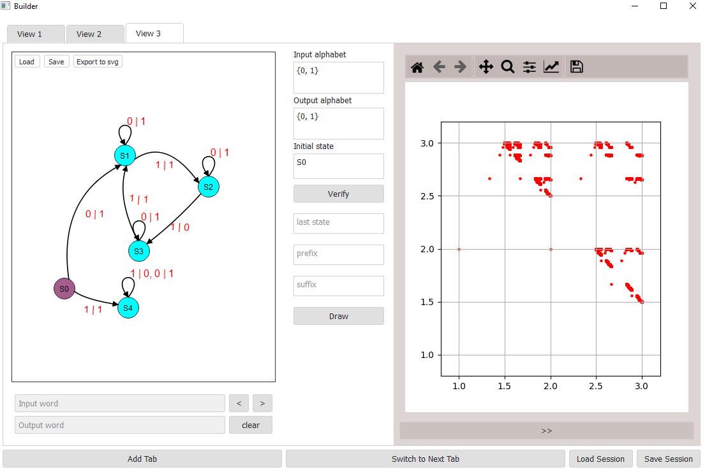
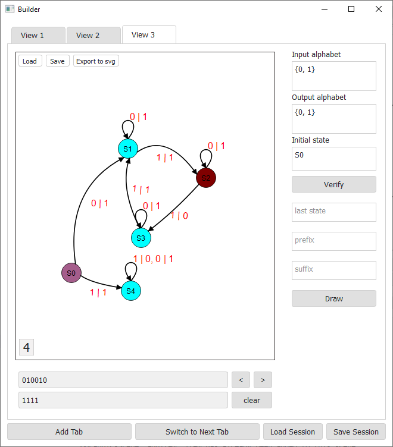

# Automata builder
```To build and install run installer.py (if you want verbose installation use the -v flag).```

### Main features

- Build transitions graph of automata;
- See how automata process the input word in each tact;
- Draw geometry image of automata (you can also filter points). 



### Also

- Work with multiple automata in different tabs;
- Save progress;
- Export transitions graph in svg.

#### Examples


